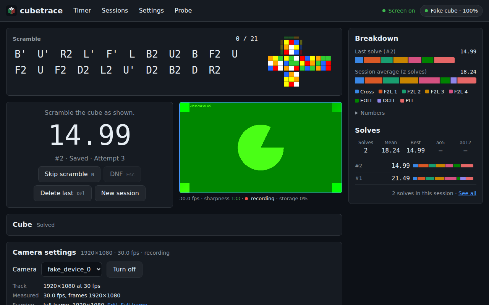

# cubetrace

cubetrace is a Chrome web app that times speedcube solves on a GAN Bluetooth cube. It works like
Cubeast: it shows a scramble, follows the cube while you scramble it, starts the time with your
first turn, stops it when the cube is solved, and breaks each solve into its CFOP phases. Its side
effect is a dataset: every attempt is kept with its scramble, every move on the device's clock and
on the cube's, and its phases. The later phases of the [plan](docs/PLAN.md) add video: the device's
own camera first, then phones as extra cameras, each recording the solves in sync with the moves.

**Status:** version 0.1.0, phase 1 (the timer), before the owner's first test round on the real
cubes and phones ([`docs/MANUAL-TESTS.md`](docs/MANUAL-TESTS.md)). What it does is listed in
[`docs/CHANGELOG.md`](docs/CHANGELOG.md).

## Use it

Open **https://shermam.github.io/cubetrace/** in Chrome on Android, macOS or Windows. The cube talks
to the app over Web Bluetooth, which Safari, Firefox and Chrome on iPhone and iPad lack; Chrome on
Linux has it behind `chrome://flags/#enable-experimental-web-platform-features`.

**Connect a cube.** Turn the cube on, click "Connect a cube" on the Timer page or the cube pill in
the header ("Connect cube"), and choose the cube in Chrome's list of Bluetooth devices, which opens
at once. The GAN driver also needs the cube's MAC address:

- With `chrome://flags/#enable-web-bluetooth-new-permissions-backend` enabled, Chrome reads it by
  itself, and choosing the cube is all it takes. To enable it, paste that address in Chrome's
  address bar, set the flag to Enabled and relaunch Chrome.
- Without the flag, a dialog asks for the address once the cube is chosen: six hex bytes such as
  `AB:12:CD:34:EF:56` (`chrome://bluetooth-internals` lists nearby devices with their addresses).
  The flag's steps are folded under it, with a Copy button. With "Remember it for this cube" on,
  Settings keeps it, and the next connection does not ask.

Once the cube is connected, no dialog is left open: the pill shows the cube's model and battery
(click it for the cube's details and Disconnect). If connecting fails, the reason appears under the
button, with a Details link. Scramble the cube as the Timer page shows: the progress counts the
moves, and a wrong turn brings up the moves that undo it. The time starts with the first turn after
the scramble and stops when the cube is solved. `N` skips the scramble, `Esc` marks a DNF, `Delete`
removes the last attempt.

If the net in the Timer page's Cube section and the cube in your hands disagree (turns made while
the cube was asleep or disconnected), solve the cube and click "Mark as solved" there or in the
pill's details: the cube's own state is set to solved, and the attempt under way begins again with
its scramble, without a record. A cube left 5 minutes without a turn is disconnected to save its
battery (Settings → Idle cube; 0 never does it); the pill and the Timer page say why, and Reconnect
takes one click.

**Demo mode.** Without a cube, https://shermam.github.io/cubetrace/?demo=0&speed=20 connects a fake
cube that replays recorded solve 0 (of 30, `?demo=0` to `?demo=29`) at 20 times its speed: the
scramble, the solve, the time and the breakdown. "Try the demo", next to "Connect a cube" on the
Timer page, replays a random one at the speed set in Settings. The demo solves are downloaded when a
demo starts, so demo mode needs the network.

**Install it** from Chrome's menu (Install app, or Add to Home screen on Android) or with the
install button in the address bar on a laptop. The installed app opens offline, and Chrome grants it
persistent storage more readily (Settings → Keep my data).

**Your data** stays in the browser, in the site's origin private file system (OPFS): a folder per
session with its `session.json` and an `attempt.json` per attempt
([`docs/DATA-MODEL.md`](docs/DATA-MODEL.md)). Nothing is uploaded. The Sessions page exports a
session as one JSON file, or deletes it; clearing the site's data in Chrome deletes all of them.
Phase 3 adds cloud storage, so that the sessions of every device end up in one dataset.

## Screenshots

Demo mode at real-time speed, taken with Playwright from a production build served as GitHub Pages
serves it. The timer on a laptop after two solves: the next scramble and its picture, the last time,
the CFOP breakdown and the solve list.



The same on a phone in portrait, 390 px wide, and the connect dialog in Chrome without the MAC
address flag, once the cube is chosen:

<p>
  
  
</p>

The Sessions page, with Export and Delete for each session:


## Development

Requirements: Node.js 22.22.3 or a later 22.x release (the Angular CLI's minimum; `engines` also
accepts 24.15 and later) with npm 10. Run the commands from the repository root.

| Command | What it does |
|---|---|
| `npm ci` | install everything (npm workspaces: `apps/*`, `packages/*`) |
| `npm start` | dev server on http://localhost:4200 (`ng serve`) |
| `npm run build` | production build into `apps/web/dist/web/browser` (`ng build`) |
| `npm test` | package tests (Vitest), then the app's tests (`ng test`, single run, jsdom) |
| `npm run test:watch` | package tests in watch mode; for the app, `npm run test -w @cubetrace/web` |
| `npm run e2e` | Playwright end-to-end tests in Chromium (starts `ng serve` on port 4200 and a production build on port 4300, unless servers already run there) |
| `npm run lint` | type-check, `eslint .`, then `ng lint` for the app |
| `npm run format` / `npm run format:check` | Prettier write / check |

`npm run e2e` needs the Chromium build that Playwright 1.56.1 drives. On a new machine, install it
once with `npx playwright install chromium`. The versions and the reasons behind the setup are in
[`docs/TOOLCHAIN.md`](docs/TOOLCHAIN.md); the rules for contributors, human or agent, are in
[`CLAUDE.md`](CLAUDE.md).

Every push to `main` builds the app with `--base-href /cubetrace/` and publishes it to GitHub Pages
(`.github/workflows/pages.yml`). Pull requests and pushes run `.github/workflows/ci.yml`: lint,
format check, tests, build and the end-to-end tests.

## Repository layout

```
apps/web/          the Angular app (standalone components, signals, SCSS, PWA); Playwright tests in apps/web/e2e/
packages/core/     @cubetrace/core: notation, cube simulator, scrambles, CFOP phases, attempt state machine, records, statistics, JSON Schemas
packages/gan/      @cubetrace/gan: GAN Bluetooth driver wrapper, Bluetooth support check, fake cube
packages/storage/  @cubetrace/storage: the session store over the origin private file system
fixtures/          real solves and cube identities, the tests' reference data (read-only)
docs/              plan, architecture, data model, toolchain, manual tests, owner's actions, changelog, screenshots
```

The packages are plain TypeScript, tested in Node, and never import Angular.

## Documentation

- [`CLAUDE.md`](CLAUDE.md): rules for everyone working in the repository
- [`docs/PLAN.md`](docs/PLAN.md): phases, tasks and acceptance criteria
- [`docs/ARCHITECTURE.md`](docs/ARCHITECTURE.md): modules and their contracts
- [`docs/DATA-MODEL.md`](docs/DATA-MODEL.md): the JSON the app produces
- [`docs/TOOLCHAIN.md`](docs/TOOLCHAIN.md): versions, commands and toolchain decisions
- [`docs/MANUAL-TESTS.md`](docs/MANUAL-TESTS.md): checks that need a real cube or phone
- [`docs/USER-ACTIONS.md`](docs/USER-ACTIONS.md): things only the owner can do
- [`docs/CHANGELOG.md`](docs/CHANGELOG.md): what each version changed

## Data

- **Records.** An attempt is an `attempt.json`: its scramble and the scrambled state, its events
  (scramble shown, started and done, pickup, solve start and end), every move with its host and cube
  time, the result and the eight CFOP phases. A session is a `session.json`: the device, the cube,
  the settings, the fit of the cube's clock to the device's, and a summary. Both are specified in
  [`docs/DATA-MODEL.md`](docs/DATA-MODEL.md) (schema version 1) and as JSON Schemas (draft 2020-12)
  in [`packages/core/schema/`](packages/core/schema/), which the tests check records against.
- **Fixtures.** `fixtures/solves.json` holds 300 real solves from the owner's Cubeast export: the
  scramble, the scrambled state, the raw move stream on the cube's clock, and Cubeast's results and
  phase times. `fixtures/identities.json` holds reference cube states for the simulator's tests. A
  private script generated both; they are read-only. The tests compare against them, and demo mode
  replays the first 30 solves.

## Licence

MIT ([`LICENSE`](LICENSE)), copyright 2026 shermam. The app bundles cubing.js (MPL-2.0 or
GPL-3.0-or-later), the owner's fork of gan-web-bluetooth (MIT), Angular (MIT) and RxJS
(Apache-2.0), each under its own licence.
