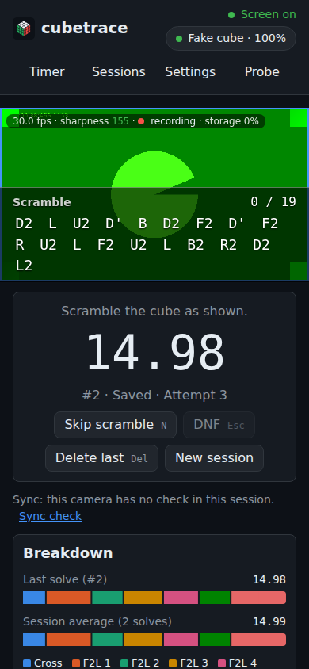
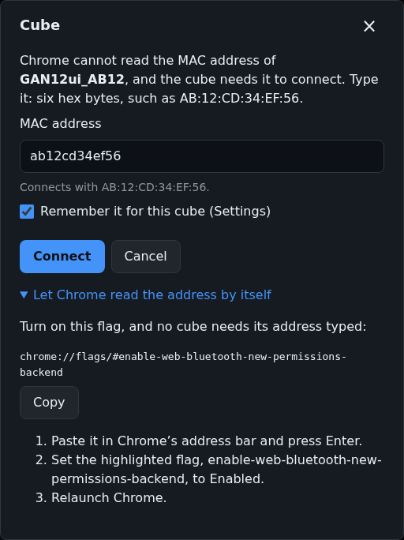
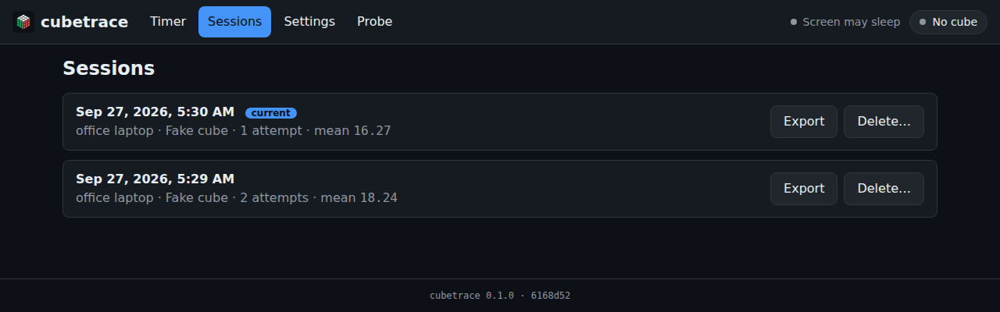

# cubetrace

cubetrace is a Chrome web app that times speedcube solves on a GAN Bluetooth cube. It works like
Cubeast: it shows a scramble, follows the cube while you scramble it, starts the time with your
first turn, stops it when the cube is solved, and breaks each solve into its CFOP phases. Its side
effect is a dataset: every attempt is kept with its scramble, every move on the device's clock and
on the cube's, its phases and, with the device's camera on, two video clips of it in sync with the
moves. Signed in, the sessions of every device end up in one dataset in the cloud; the later phases
of the [plan](docs/PLAN.md) add phones as extra cameras.

**Status:** version 0.3.0: phase 3 (the cloud: an optional account, the session index, the uploads,
the cubes' MAC addresses on every device) on top of phases 1 (the timer) and 2 (the device's own
camera), before the owner's third test round, on two devices with one account
([`docs/MANUAL-TESTS.md`](docs/MANUAL-TESTS.md), Round 3). What each version does is listed in
[`docs/CHANGELOG.md`](docs/CHANGELOG.md).

## Use it

Open **https://shermam.github.io/cubetrace/** in Chrome on Android, macOS or Windows. The cube talks
to the app over Web Bluetooth, which Safari, Firefox and Chrome on iPhone and iPad lack; Chrome on
Linux has it behind `chrome://flags/#enable-experimental-web-platform-features`.

**Connect a cube.** Turn the cube on, click "Connect a cube" on the Timer page or the cube pill in
the header ("Connect cube"), and choose the cube in Chrome's list of Bluetooth devices, which opens
at once. The GAN driver also needs the cube's MAC address:

- With `chrome://flags/#enable-web-bluetooth-new-permissions-backend` enabled, Chrome reads it by
  itself, and choosing the cube is all it takes. To enable it, paste that address in Chrome's
  address bar, set the flag to Enabled and relaunch Chrome.
- Without the flag, a dialog asks for the address once the cube is chosen: six hex bytes such as
  `AB:12:CD:34:EF:56` (`chrome://bluetooth-internals` lists nearby devices with their addresses).
  The flag's steps are folded under it, with a Copy button. With "Remember it for this cube" on,
  Settings keeps it, and the next connection does not ask. Signed in (Cloud, below), the account
  keeps Settings' list too, so that an address typed on one of your devices is known on the others
  from their next start.

Once the cube is connected, no dialog is left open: the pill shows the cube's model and battery
(click it for the cube's details and Disconnect). If connecting fails, the reason appears under the
button, with a Details link. Scramble the cube as the Timer page shows: the progress counts the
moves, and a wrong turn brings up the moves that undo it. The time starts with the first turn after
the scramble and stops when the cube is solved. `N` skips the scramble, `Esc` marks a DNF, `Delete`
removes the last attempt.

If the net in the Timer page's Cube section and the cube in your hands disagree (turns made while
the cube was asleep or disconnected), solve the cube and click "Mark as solved" there or in the
pill's details: the cube's own state is set to solved, and the attempt under way begins again with
its scramble, without a record. A cube left 5 minutes without a turn is disconnected to save its
battery (Settings → Idle cube; 0 never does it); the pill and the Timer page say why, and Reconnect
takes one click.

**Demo mode.** Without a cube, https://shermam.github.io/cubetrace/?demo=0&speed=20 connects a fake
cube that replays recorded solve 0 (of 30, `?demo=0` to `?demo=29`) at 20 times its speed: the
scramble, the solve, the time and the breakdown. "Try the demo", next to "Connect a cube" on the
Timer page, replays a random one at the speed set in Settings. The demo solves are downloaded when a
demo starts, so demo mode needs the network.

**Install it** from Chrome's menu (Install app, or Add to Home screen on Android) or with the
install button in the address bar on a laptop. The installed app opens offline, and Chrome grants it
persistent storage more readily (Settings → Keep my data).

**Your data** stays in the browser, in the site's origin private file system (OPFS): a folder per
session with its `session.json` and a folder per attempt with its `attempt.json` and its clips
([`docs/DATA-MODEL.md`](docs/DATA-MODEL.md)). Signed out, nothing is uploaded. The Sessions page, and
each session's page, export a session's records as one JSON file, without the video, or delete the
session with its clips; an attempt's clips are downloaded from its clip badge (Recording, below).
Clearing the site's data in Chrome deletes all of them. Signed in, the sessions are also uploaded to
your account's storage in the cloud (Cloud, below), so that the sessions of every device end up in
one dataset.

## Recording

**Turn the camera on** in Camera settings, below the Cube section of the Timer page: choose the
camera ("Front camera" or "Rear camera" on a phone) and click Turn on. Chrome asks for the camera
once, and for the microphone when recording starts (Record audio, in Camera settings and in Settings
→ Camera, leaves the sound out). The camera stays on across reloads until Turn off. Its picture then
stays beside the time, mirrored for a front camera, so that the cube can be kept in frame while
scrambling and solving, with one line under it: the frame rate measured, the sharpness (green when
good, amber when soft), what the recording does (idle, recording, saving) and how full storage is.
On a phone the picture is at the top of the page instead, as wide as the screen, with that line over
its top left corner and the scramble over its lower part, on a dark strip through which the picture
shows; both stay at the top of the window while the page scrolls, and with the camera off the
scramble stays there alone. Settings → Timer → "Scramble over the picture (phone)", turned off, puts
the picture under the time and pins nothing. Camera settings also show what the camera claims next
to what it delivers (a phone may claim 60 fps and deliver 30), and the manual controls it has:
exposure and ISO, focus, white balance, zoom and torch, with Reset to auto. Settings → Camera has
the resolution (1920×1080 or 1280×720), the frame rate asked for, the video quality and the
microphone (below) and the sharpness meter's threshold.

**The framing rectangle** is the part of the picture the model will learn from, drawn on the
camera's picture. Framing → Edit, in Camera settings, shows a larger picture on which it is dragged
and resized with the mouse, a finger or the arrow keys (with Shift for its size); Full frame resets
it. It is kept per camera and frame size, the sharpness meter measures inside it, and every clip
records it as its `crop`; the video itself keeps the whole frame. Keep the cube and the hands inside
it.

**What is recorded.** While the camera is on and a session is under way, the camera and the
microphone are encoded without pause into the last 90 s kept in memory (at most 160 MB): H.264 where
Chrome has an encoder for it, else VP9, and AAC, else Opus, for the sound, with a keyframe every
second. Nothing of it is stored but the attempts' clips: each attempt gets two, cut from memory
without re-encoding about a second after their end.

| Clip | From | To |
|---|---|---|
| scramble | 2 s before the scramble's first turn, but at most 60 s before the cube matches it | 1 s after the cube matches the scramble |
| solve | 3 s before the solve's first turn | 1 s after the cube is solved, or the DNF |

A clip begins at the keyframe at or before its start, so up to a second earlier. A DNF before the
solve's first turn has the scramble clip only, and an attempt that goes (Delete last, Mark as
solved) takes its clips with it. Each clip is an MP4 file named after the camera's label (`laptop`,
or `phone-front` and `phone-rear` on a phone; `laptop-2` for another camera of the laptop in the
same session) and the segment, such as `laptop.solve.mp4`, with the
time of each of its frames on the device's clock (`laptop.solve.frames.json`), and is listed in the
attempt's `attempt.json` (`video`); the attempt's timing never waits for them. A clip that could not
be saved is said once in Camera settings, in Chrome's console (`cubetrace: clip failed: …`) and in
the session's `notes`. A clip whose start is older than the 90 s in memory (the first scramble right
after the camera is turned on, a solve longer than that) begins at the oldest frame there instead:
it is marked "late" on its badge and in the viewer (`truncatedStart` in its entry), and said in
Camera settings and in the session's `notes` (`clip truncated: …`); turn the camera on a few seconds
before scrambling. The sound is recorded when Chrome gives the microphone: when it is not, Camera
settings say where it is (no sound from the microphone yet, stopped, and why), and a clip without
sound says why in a notice and in the session's `notes`.

**The microphone is recorded raw**, so that the sound has every turn's click: Chrome's voice
processing (echo cancellation, noise suppression, automatic gain control), which keeps speech and
takes a cube's clicks for noise, is asked off (with it, a phone's clips had a TV's voices and none of
the cube's sounds). Microphone, next to Record audio in Camera settings and in Settings → Camera, has
Raw, the default, and Voice, the browser's defaults, for someone who wants speech. Camera settings
say which after the codecs ("mic raw", "mic voice"), and "mic: the browser kept processing on", with
a notice naming it, when the browser keeps some of it on anyway; the session keeps what the browser
applied (`microphone` in its camera's entry, `docs/DATA-MODEL.md` §6).

**The sync check** measures how far the camera's frames lag the cube. When the camera records in a
session that has no check of it yet, with a cube connected, the check is due by itself before the
next scramble's first turn: a panel under the camera's picture asks first for a framing rectangle
around the cube while the rectangle is the whole frame ("Edit the framing", or "Start anyway"), then,
after a second of holding still, to hold the cube still and flick one face with one finger, flick it
back a second later, and so five times, counting the turns ("Turn 3 of 10"). Meanwhile, and until
the cube has been still for a few seconds after it, the timer tracks no attempt, so the check's turns
are in no record; then the attempt begins again with its scramble and number. A second after the
tenth turn the panel says "Camera lags the cube by X ms (±Y)": X is how much later the middle of a
turn's motion shows in the camera's frames than the cube's report of the turn arrives over
Bluetooth (the median over the turns kept), and Y the range of those lags (the fifth of the turns
whose lags are farthest from the median are left out). A frame at host time t thus shows the cube as
the move log has it at t − X. The lag is
kept in the session (`clock.cameras`) and in every later clip of that camera (`syncResidualMs`), for
the training to subtract. A check that fails says why (the cube did not move, no motion in the
framing rectangle, fewer than 4 matches, a spread over 50 ms plus a frame), with Retry and "Download
check data", a file of what the camera saw around each turn to attach to an issue; Later hides it,
and "Sync check", under the camera's picture, runs it again between attempts.

**Video quality**, in Camera settings and in Settings → Camera, sets the video's bitrate, and so
what the clips take: Standard, the default, 4 Mbps at 1920×1080 and 30 fps, about 20 MB per attempt
(its two clips last about 40 s); High, 8 Mbps, about 40 MB; Maximum, 12 Mbps, about 60 MB. 1280×720
takes 0.44 times as much, and 60 fps 1.5 times as much; each choice says its bitrate and size at the
resolution and frame rate chosen. Standard is plenty for the hands and the cube: the first recordings
on a MacBook, at the 8 Mbps then asked for, took 35–42 MB per attempt, which would fill the browser's
10 GB in two days of the owner's solves (`docs/DEVICES.md`). Camera settings give the bitrate in use
next to the codecs ("avc1.640028 at 4 Mbps, mp4a.40.2, mic raw") and, under the storage meter, what
an attempt takes at it. A change starts the recording again, as one of Record audio or Microphone
does: make it between attempts.

**Storage.** Camera settings and the Sessions page have a storage meter: how much of the browser's
quota the site uses (about 10 GB on the owner's laptop and phone, `docs/DEVICES.md`). From 80% it
warns; from 95% the camera stops recording, while the timer goes on, until sessions are exported and
deleted. Each clip badge, each row of the Sessions page and each session's page say how much its
clips take.

**Where the files are.** In the site's origin private file system, next to the records:
`sessions/<session id>/attempts/0001/` holds `attempt.json`, the attempt's four clip files and, for a
cube with a gyroscope, `gyro.json`, the gyroscope's samples over the attempt (T3.7). The
Timer page lists the session's last 12 solves; "See all" under them, or a session's date on the
Sessions page, opens the session's page, with all its attempts, its statistics (ao100 too) and the
storage its clips take. Each list shows a badge on each attempt with clips ("2 clips, 1.6 MB"),
which opens the clip viewer: the clip plays next to the attempt's moves by time, the one on screen
highlighted (a click on a move goes to it), and under the video a 3D cube follows it (T3.8): it
turns with the moves as the picture shows them (the camera's lag from the sync check applied) and,
when the attempt has a `gyro.json`, tilts and turns as the real cube did, upright at the clip's
first frame ("Re-zero" makes the current moment upright; "Raw" shows the gyroscope's own frame, whose
yaw is arbitrary); without one, a line says the orientation is not recorded. The cube is seen
straight on, from the front (T3.10); under it, Turn ◀ ▶, Tilt ▲ ▼, Behind and Reset view move the
viewpoint in quarter turns, a drag with the mouse or a finger turns it freely, and Mirror reflects
the orientation shown, for a camera behind or beside the cube (or a cube whose gyroscope's axes
differ): the view and the mirror are kept per camera, on the device and, signed in, in the account.
To calibrate, pause where the cube is square to the camera and press Re-zero; if tilts go the other
way, choose a mirror. Download saves the attempt's files: both MP4s, both frames files, `gyro.json`
when there is one, and `attempt.json` (Chrome may ask once to allow multiple downloads).

## Cloud

An account is optional. Signed in, the sessions of all your devices end up in one dataset: an index
of them in Firestore, their files in a Google Cloud Storage bucket, and the cubes' MAC addresses
known on every device. Signed out, the app works as before: nothing leaves the device, and Firebase
is never downloaded.

**The account.** Sign in, in the header or in Settings → Account, signs in with Google (in a popup;
over the app installed on Android, a Chrome tab of its own that closes itself). The account records
your name, your email and each device's label, and stays signed in across reloads, offline too,
until Sign out.

**What syncs**, through Firestore, whose cache on the device keeps each change while offline and
sends it once the network is back:

- **The session index.** Every session of a real cube, as it is recorded: the session's record and
  each attempt's, without the moves, with the device that recorded it and the state of its upload.
  Sessions recorded signed out are added at the next sign-in. The Sessions page then lists the
  sessions of all your devices, each with a badge ("this device", "cloud" or "both") and a filter by
  device; a session recorded on another device opens read-only, since its clips and moves are on
  that device (and in the bucket). Sessions → QA view counts the attempts by day and device, with
  what their clips take, what is uploaded and what is pending, and when this device last synced.
- **The cubes' MAC addresses** of Settings → Cube MAC addresses (where the connect dialog's
  "Remember it for this cube" keeps one too): each device merges its list with the account's as it
  signs in and as it starts, the latest change of each cube winning, and sends each change as it is
  made, so that an address typed on the phone is known on the laptop, and a cube removed on one
  device goes on the others. Settings says when the list last merged.
- **The clip viewer's view and mirror per camera** (T3.10): each device merges its choices with the
  account's as it signs in and as it starts (its own for the cameras it has set, the account's for
  the others) and sends each change a second after the last, so that a camera's view chosen once
  opens the same on every device.

**What uploads.** Each attempt of a real cube's session, once it is over and its clips are saved:
its `attempt.json` (with the moves), each clip's MP4 and frame times, and the session's
`session.json` (again when it changes, once the session has been quiet for two minutes), into the
bucket under `users/<your id>/sessions/<session id>/`. The files go two at a time, each through a
URL that the account's Cloud Functions sign for its exact size and type, valid 15 minutes; a failure
is tried again after 1 s, 2 s, 4 s, … up to 5 minutes, and a file the bucket refuses waits for
Retry. A reload, or the next start, goes on where the uploads were (`uploads.json` on the device,
and the index, say what is uploaded), without sending a file twice; only one tab uploads at a time.
The Sessions page has the uploads' panel (the attempts still to upload with their progress and
errors, Retry, those uploaded last, paused by the quota or waiting for the network), the header an
arrow with the attempts still to upload, and a session's page each attempt's upload.

**What never leaves the device**: demo sessions (the fake cube), anything while signed out, and the
settings. The cubes' MAC addresses are the account's, in documents of their own, never the
dataset's: no record holds one, so no export, upload or document of the index does.

**Diagnostics.** Signed in, the app also keeps a log of its own use in your account
(`users/<your id>/events`, [`docs/DIAGNOSTICS.md`](docs/DIAGNOSTICS.md)): when it starts and which
build, when a cube connects or disconnects and why, each attempt's outcome and timing, each clip
saved or failed, the sync checks, the uploads' progress, the settings changed and the errors it
meets, each with the device's label, never a MAC address, an email, a video or a user agent. The
owner's round report reads it in place of the manual test checklists. Settings → Account →
Diagnostics, on by default, turns it off; nothing is kept while signed out either way, and a device
writes at most 2,000 events a day.

**The policies**, in Settings → Uploads: Upload sessions turns the uploads off; Wi-Fi only, on a
phone whose browser tells Wi-Fi from mobile data (on by default there), waits for Wi-Fi; Keep local
copies, on by default on a laptop and off on a phone, keeps the clips on the device once they are
uploaded: off, an attempt's clips are deleted from it once all its files are uploaded (its
`attempt.json` and frame times stay, and the clip says "in the cloud"). In any case, once the
browser's storage is 70% full, the oldest uploaded clips are deleted until it is under 60%. Each
account may have 6 GB and 1,200 files signed per UTC day, every signature counted: at most 200 attempts
with their clips and gyro files (six files each: `attempt.json`, two MP4s, two frames files and
`gyro.json`); past it, the uploads wait for the next UTC day, and the panel says until when.

**Whose cloud.** The account, the index and the bucket are the owner's: the Firebase project
`cubetrace-cacd9` (Authentication with Google, Firestore in `nam5`, the Cloud Functions in
`us-central1`) and the bucket `cubetrace-data` (Google Cloud Storage, `us-central1`), which is
private and which only the functions' URLs write to. Each account reads and writes only its own
documents (the Firestore rules, [`docs/DATA-MODEL.md`](docs/DATA-MODEL.md) §10), and its uploads go
into its own folder of the bucket alone. Anyone can sign in, but until phase 5 of the
[plan](docs/PLAN.md) brings a consent flow and a way to delete one's data, the cloud is meant for
the owner's own devices.

**Costs.** The project runs on a Google Cloud free trial whose credit pays, until 2026-12-27,
Firestore, the functions, the bucket's storage and its egress: one solver's camera makes roughly 100
to 130 GB a month, a few dollars of storage, and downloading the dataset to the training machine
costs about US$ 0.12 per GiB. Before the trial ends, the owner chooses between Cloud Storage, paid,
and Cloudflare R2, without egress fees, which the functions support by configuration
(`BUCKET_PROVIDER`, [`functions/README.md`](functions/README.md)). Without a choice, the functions
and the bucket stop with the trial: the uploads wait, and the app goes on recording on the device.

## Screenshots

Demo mode at real-time speed, taken with Playwright from a production build served as GitHub Pages
serves it, with Chrome's test camera standing in for a real one. The timer on a laptop after two
solves: the next scramble and its picture, the last time with the camera's picture beside it, the
CFOP breakdown and the solve list.


The same on a phone in portrait, 390 px wide, the camera's picture at the top with the scramble over
it, and the connect dialog in Chrome without the MAC address flag, once the cube is chosen:

<p>
  
  
</p>

The Sessions page, with Export and Delete for each session:



A session's page, opened from "See all" under the Timer's solves or from its date on the Sessions
page: its facts and statistics, the storage its clips take, and every attempt with its clip badge:


## Development

Requirements: Node.js 22.22.3 or a later 22.x release (the Angular CLI's minimum; `engines` also
accepts 24.15 and later) with npm 10. Run the commands from the repository root.

| Command | What it does |
|---|---|
| `npm ci` | install everything (npm workspaces: `apps/*`, `packages/*`, `functions`) |
| `npm start` | dev server on http://localhost:4200 (`ng serve`) |
| `npm run build` | production build into `apps/web/dist/web/browser` (`ng build`) |
| `npm test` | package tests (Vitest), then the app's tests (`ng test`, single run, jsdom) |
| `npm run test:rules` | the Firestore rules' tests against the Firestore emulator (needs Java 21; the Firebase CLI comes through npx) |
| `npm run test:functions` | builds the Cloud Functions, then runs their tests against the Firestore emulator (needs Java 21) |
| `npm run test:watch` | package tests in watch mode; for the app, `npm run test -w @cubetrace/web` |
| `npm run e2e` | Playwright end-to-end tests in Chromium (starts `ng serve` on port 4200 and a production build on port 4300, unless servers already run there) |
| `npm run e2e:cloud` | the end-to-end tests' cloud project: the app's own Firebase SDK against the Auth, Firestore and Functions emulators, the uploads into a bucket on this machine (needs Java 21; builds the functions, starts the emulators, then `ng serve` and the bucket on port 4600) |
| `npm run lint` | type-check, `eslint .`, then `ng lint` for the app |
| `npm run format` / `npm run format:check` | Prettier write / check |

`npm run e2e` needs the Chromium build that Playwright 1.56.1 drives. On a new machine, install it
once with `npx playwright install chromium`. The versions and the reasons behind the setup are in
[`docs/TOOLCHAIN.md`](docs/TOOLCHAIN.md); the rules for contributors, human or agent, are in
[`CLAUDE.md`](CLAUDE.md).

Every push to `main` builds the app with `--base-href /cubetrace/` and publishes it to GitHub Pages
(`.github/workflows/pages.yml`), and deploys the Firestore rules and the Cloud Functions when it
changes them (`.github/workflows/firebase.yml`). Pull requests and pushes run
`.github/workflows/ci.yml`: lint, format check, tests, the rules' and the functions' tests, build,
the end-to-end tests and their cloud project against the emulators.

## Repository layout

```
apps/web/          the Angular app (standalone components, signals, SCSS, PWA); Playwright tests in apps/web/e2e/
packages/core/     @cubetrace/core: notation, cube simulator, scrambles, CFOP phases, attempt state machine, records, statistics, JSON Schemas
packages/gan/      @cubetrace/gan: GAN Bluetooth driver wrapper, Bluetooth support check, fake cube
packages/storage/  @cubetrace/storage: the session store over the origin private file system
packages/rtc/      @cubetrace/rtc: the connection to a remote camera (phase 4): the data channel's protocol, the
                   file transfer, the clock sync's pings, the pairing token, the signaling over Firestore
packages/capture/  @cubetrace/capture: the camera and the recording
  src/camera.ts, sharpness.ts, framing.ts   constraints, manual controls, snapshots; the sharpness meter; the framing rectangle
  src/pipeline.ts, protocol.ts              startCapture(): the window's side of the capture, and its messages to the workers
  src/capture-worker.ts, ring-buffer.ts, cut.ts   the capture worker: the encoders, the last 90 s in memory, the cuts
  src/clip-worker.ts, mux.ts, clip-writer.ts      the clip worker: MP4 muxing with mediabunny, the files written into OPFS
  src/motion.ts, clapperboard.ts            the sync check: the motion in the framing rectangle, and the lag it gives
firebase/          the Firestore rules and their tests (firebase.json and .firebaserc at the root: the project cubetrace-cacd9)
functions/         the Cloud Functions: signUpload and confirmUpload, the signed uploads into the bucket (functions/README.md)
bucket/            the bucket's CORS policies, for Google Cloud Storage and Cloudflare R2, and how to set the bucket up
fixtures/          real solves, cube identities, the round 1 exports (hardware/) and a second of encoded video (media/): the tests' reference data (read-only)
docs/              plan, architecture, data model, toolchain, manual tests, devices, owner's actions, changelog, screenshots
```

The packages are plain TypeScript, tested in Node, and never import Angular.

## Documentation

- [`CLAUDE.md`](CLAUDE.md): rules for everyone working in the repository
- [`docs/PLAN.md`](docs/PLAN.md): phases, tasks and acceptance criteria
- [`docs/ARCHITECTURE.md`](docs/ARCHITECTURE.md): modules and their contracts
- [`docs/DATA-MODEL.md`](docs/DATA-MODEL.md): the JSON the app produces
- [`docs/TOOLCHAIN.md`](docs/TOOLCHAIN.md): versions, commands and toolchain decisions
- [`docs/MANUAL-TESTS.md`](docs/MANUAL-TESTS.md): checks that need a real cube or phone
- [`docs/DEVICES.md`](docs/DEVICES.md): what the owner's devices and their cameras can do, measured
- [`docs/USER-ACTIONS.md`](docs/USER-ACTIONS.md): things only the owner can do
- [`docs/CHANGELOG.md`](docs/CHANGELOG.md): what each version changed

## Data

- **Records.** An attempt is an `attempt.json`: its scramble and the scrambled state, its events
  (scramble shown, started and done, pickup, solve start and end), every move with its host and cube
  time, the result, the eight CFOP phases and its clips. A session is a `session.json`: the device,
  the cube, the cameras, the settings, the clock fits, and a summary. Both are specified in
  [`docs/DATA-MODEL.md`](docs/DATA-MODEL.md) (schema version 2) and as JSON Schemas (draft 2020-12)
  in [`packages/core/schema/`](packages/core/schema/), which the tests check records against.
- **Schema 2** (0.2.0). Every `attempt.json` has `clock`, the fit of the host time on the cube time
  over its own moves, which places each move on the device's clock without the Bluetooth jitter (the
  cube's clock runs about 0.7% slow while it is turned, so one fit per session drifts across the
  pauses), and `video[]`, its clips: camera and segment, the MP4 file and its size, the codecs, the
  frame size, the framing rectangle (`crop`), the number of frames, the host time of the first one,
  the frames file and the camera's lag from the sync check (`syncResidualMs`). `session.json` lists
  the cameras (`cameras`: label, facing, the browser's settings, capabilities and constraints, the
  framing) and their sync checks (`clock.cameras`). Each clip's `<camera>.<segment>.frames.json`
  gives the host time of its first frame (`t0HostMs`) and the interval before each of the others
  (`dtMs`, from the frames' own timestamps), and its keyframes. Records of version 1 (written by
  0.1.0) are read as version 2 and never rewritten; [`docs/DATA-MODEL.md`](docs/DATA-MODEL.md) has
  every field.
- **Fixtures.** `fixtures/solves.json` holds 300 real solves from the owner's Cubeast export: the
  scramble, the scrambled state, the raw move stream on the cube's clock, and Cubeast's results and
  phase times. `fixtures/identities.json` holds reference cube states for the simulator's tests. A
  private script generated both; they are read-only. The tests compare against them, and demo mode
  replays the first 30 solves.

## Licence

MIT ([`LICENSE`](LICENSE)), copyright 2026 shermam. The app bundles cubing.js (MPL-2.0 or
GPL-3.0-or-later), the owner's fork of gan-web-bluetooth (MIT), mediabunny (MPL-2.0), Angular (MIT),
RxJS (Apache-2.0) and the Firebase JavaScript SDK (Apache-2.0), each under its own licence.
